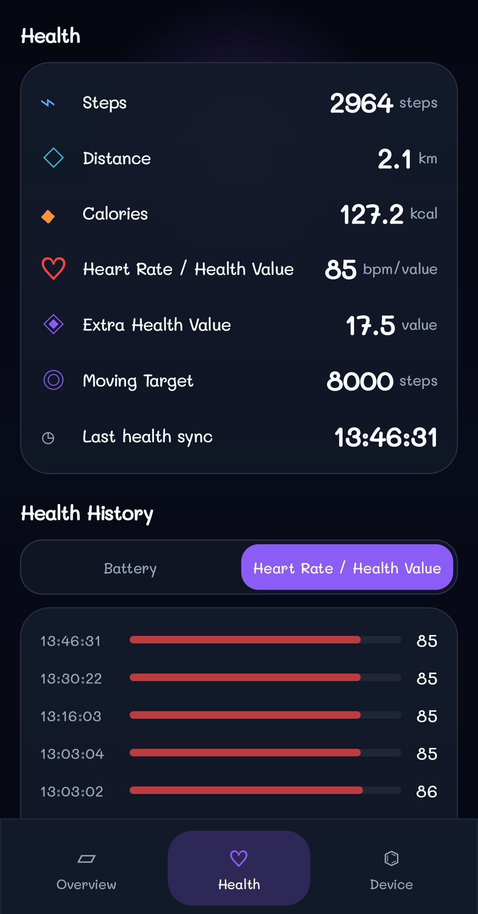

# Muba’s Watch Companion

Open-source Android companion app for KC10 / C7S / WiiWatch2-compatible smartwatches.

Muba’s Watch Companion is an independent interoperability and research app focused on a clean, usable Android companion experience for watches that speak the confirmed KC10 Classic Bluetooth protocol.

## Screenshots

Screenshots will be added here before the first tagged release.

<!--



-->

## Current Status

The app is in early v0.1 stabilization. The core KC10 connection and MessageBean protocol path is working on the tested device listed below. Advanced lab tools remain available in the app for careful protocol research, but the default experience is now a companion-style dashboard.

## Confirmed Working Features

- Classic Bluetooth SPP connection
- Java ObjectStream handshake
- MessageBean object decoding
- Live dashboard
- Battery request
- Find Watch ON/OFF
- Heart Rate start/stop
- Raise to Wake ON/OFF
- Device info parsing
- Local history
- Reconnect cooldown

## Supported / Tested Device

- Device: KC10
- Model/platform: C7S
- Firmware: KC10_V1.5_B_20191111
- Android: 7.1.1
- Build info: 4.4.22 Mon Nov 11 09:59:41 CST 2019

Other WiiWatch2-compatible devices may work, but they are not confirmed yet.

## Protocol Notes

- Transport: Classic Bluetooth SPP
- UUID: `00001101-0000-1000-8000-00805f9b34fb`
- Stream: Java ObjectStream
- Serializable class name: `com.wiitetech.WiiWatchPro.bluetoothutil.MessageBean`
- `serialVersionUID`: `12141117`
- Fields:
  - `cmd`
  - `true_false`
  - `order`
  - `maxValue`
  - `currentValue`
  - `str`
  - `identifier`
  - `bytes`

More detail is available in [docs/protocol.md](docs/protocol.md).

## Build Instructions

Requirements:

- Android Studio or the Android command-line SDK
- JDK 11 or newer
- Android SDK matching the project configuration

Build from the repository root:

```bash
./gradlew assembleDebug
./gradlew lintDebug
```

On Windows:

```powershell
.\gradlew.bat assembleDebug
.\gradlew.bat lintDebug
```

No signing configuration is required for the debug build.

## Contributing

Contributions are welcome, especially:

- Device compatibility reports
- Carefully redacted protocol observations
- UI polish
- Safer command testing
- Documentation improvements

Please read [CONTRIBUTING.md](CONTRIBUTING.md) before opening issues or pull requests.

## Safety Disclaimer

This project is an independent open-source interoperability/research project.

It is not affiliated with WiiWatch2, WiiWatchPro, KC10, C7S, or any manufacturer. Users should test only with devices they own or have explicit permission to test. Firmware flashing, file transfer, and unsafe commands are not implemented.

## Roadmap

- v0.1: Companion app stabilization
- v0.2: History and charts
- v0.3: More device compatibility
- v0.4: Notification bridge
- v0.5: Watch-side Android agent exploration

See [docs/roadmap.md](docs/roadmap.md) for more detail.
